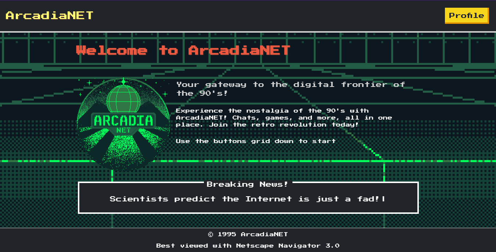

# ArcadiaNET

🌐 **ArcadiaNET** is a **pseudo-functional concept art** reimagining what a social network could have looked like in the 90s. Built for a retro-themed hackathon, it’s a playful homage to the early days of the internet, where simplicity and creativity ruled.  

  

## ✨ Key Features (or "what it pretends to do")

- 🗨️ **Chatrooms** inspired by IRC for live interactions.  
- 🖼️ **Profiles** with limited space for text and classic GIFs.  
- 📖 A **Guestbook** for leaving public messages, the precursor to today’s comments.  
- 🎮 Integrated **mini-games** like a virtual Tamagotchi or Minesweeper.  
- 🖥️ **Pixel art aesthetics** with CRT-inspired visuals and a nostalgic gradient background.  
- 🕹️ Powered by **NES.css**, for that authentic retro web vibe.  

## 🔒 The 90s Experience
No sign-ins, no emails, no modern complexities—just pick a nickname and dive in!  

## 🎨 The Vision
**ArcadiaNET** isn’t functional, but that’s the point—it’s a **visual and interactive concept** designed to spark nostalgia while celebrating the creativity of the 90s. Think of it as a love letter to the past, wrapped in pixel art and sprinkled with retro vibes. 💾
